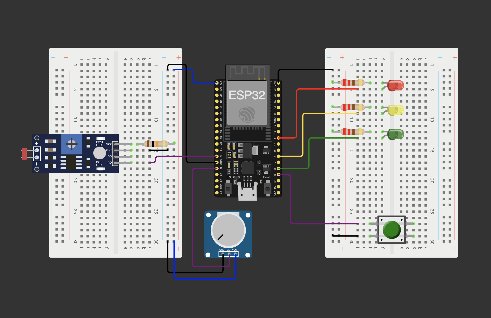

# Traffic Management System (ESP32 / FreeRTOS)

This project implements a real-time traffic light control system on an **ESP32** using **FreeRTOS** and a state machine generated with **StateSmith**.

The application utilizes a clean **Producer-Consumer architecture**, separating business logic, timing, and user input into dedicated tasks communicating via thread-safe queues.

*Developed as part of the **Technische Informatik 2** module.*

## Hardware Setup

The project is configured for a standard **ESP32 Development Board** (e.g., ESP32-WROOM / NodeMCU).

### Pin Configuration (Wiring)

| Component | GPIO Pin | Mode | Note |
| :--- | :--- | :--- | :--- |
| **LED Red** | `5` | Output | Internal LED on some boards, or external |
| **LED Yellow** | `4` | Output | Cathode to GND, use resistor |
| **LED Green** | `2` | Output | Cathode to GND, use resistor |
| **Button** | `15` | Input Pullup | Connects to **GND** when pressed |
| **LDR (Light Sensor)** | `12` | Input | Voltage divider (10kΩ resistor) |
| **Potentiometer** | `13` | Input | Center pin to GPIO 35 |

> **Note:** The button is configured as `INPUT_PULLUP`. It triggers the signal when pulled to ground (active low).

## Simulation (Wokwi)

This project includes a fully configured **Wokwi Simulation**. You can run and test the complete code virtually without physical hardware.

**How to run the simulation:**
1. Install the **Wokwi Simulator** extension in VS Code.
1. Open the file `simulation/diagram.json`.
2. **Verify Pin Configuration:** Ensure that the pins defined in `src/main.cpp` match the wiring in `simulation/diagram.json`.
3. Press `F1` and run the command **"Wokwi: Start Simulator"**.

The simulation uses the compiled firmware directly from the `.pio` folder.

## Software Architecture

The system is built on **FreeRTOS** to handle multitasking efficiently.

### Tasks & Priorities

1. **Clock Task (Prio 3):** High-priority generator that sends a `TICK` event every 1ms to the queue to ensure accurate timing.

2. **TrafficLight Task (Prio 2):** The consumer task hosting the StateSmith logic. It processes events (`TICK`, `REQUESTGREEN`) from the queue.

3. **Sensors Task (Prio 1):** Reads analog values from the LDR (brightness) and Potentiometer (green phase duration) periodically.

4. **Request Task (Prio 1):** Monitors the physical button (Pin 13) with debouncing logic and produces `REQUESTGREEN` events.

5. **Serial Task (Prio 1):** Handles user interaction via UART (Serial Monitor), robust against whitespace/newline errors.

### State Machine

The main logic is generated using **StateSmith** (`TrafficLight.hpp`/`.cpp`). It implements a standard traffic light cycle:
- `TRAFFICLIGHTGREEN`
- `TRAFFICLIGHTYELLOW`
- `TRAFFICLIGHTRED`
- `TRAFFICLIGHTREDYELLOW`
- `NIGHTMODE` (Blinking Yellow when dark)

## Installation & Usage

1. **Open Project:** Open this folder in VS Code with the **PlatformIO** extension installed.

2. **Build:** Run the "Build" task to compile the firmware.

3. **Upload (Hardware):** Connect your ESP32 and use the PlatformIO "Upload" button.

4. **Monitor:** Open the Serial Monitor at **115200 baud**.

### Serial Control

You can interact with the system via the Serial Monitor:

- Type `1`: Prints the current state of the traffic light.
- Type `2`: Simulates a pedestrian button press (`REQUESTGREEN`).

## Tech Stack

- **Hardware:** ESP32 (Espressif Systems)
- **Framework:** Arduino (via PlatformIO)
- **OS:** FreeRTOS (Tasks, Queues)
- **Modeling:** StateSmith (State machine)
- **Simulation:** Wokwi
- **Language:** C++

---

**Version:** 3.0