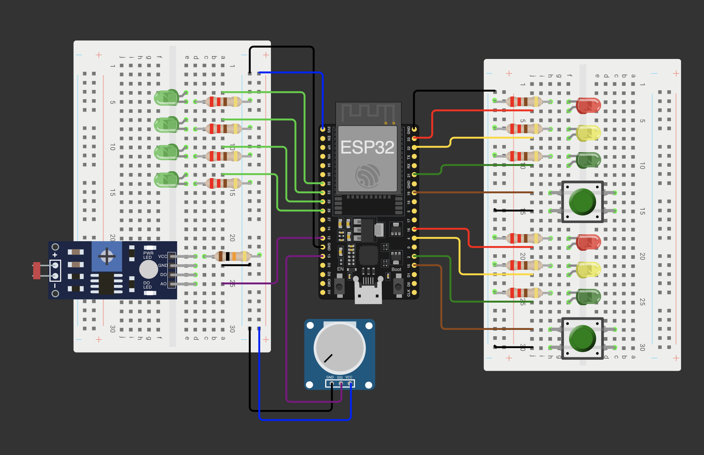

# Traffic Management System (Dual ESP32 / FreeRTOS)

This project implements a real-time traffic light control system for **two independent intersections** on a single **ESP32** using **FreeRTOS** and state machines generated with **StateSmith**.

It features a clean **Producer-Consumer architecture**, separating business logic, timing, and user input into dedicated tasks communicating via thread-safe queues. Additionally, it visualizes the configurable green-phase duration using a **4-bit binary LED display**.

*Developed as part of the **Technische Informatik 2** module.*

## Features

- **Dual Traffic Light Control:** Two independent state machines running in parallel.
- **Binary Display:** 4 LEDs display the current green-phase duration (1-10s) in binary format (0-15).
- **Night Mode:** Automatic blinking yellow mode based on LDR brightness sensor.
- **Configurable Timing:** Potentiometer adjusts the green phase duration in real-time.
- **Interactive Serial Menu:** Monitoring and control via UART.

## Hardware Setup

The project is configured for a standard **ESP32 Development Board**.

### Pin Configuration (Wiring)

| Component | GPIO Pin | Note |
| :--- | :--- | :--- |
| **Traffic Light 1** | **Red:** `23`, **Yellow:** `22`, **Green:** `21` | |
| **Traffic Light 2** | **Red:** `16`, **Yellow:** `4`, **Green:** `2` | |
| **Button 1** (Request TL1) | `19` | Active Low (Input Pullup) |
| **Button 2** (Request TL2) | `15` | Active Low (Input Pullup) |
| **Binary Display (LSB)** | `32` | Bit 0 (Value 1) |
| **Binary Display** | `33` | Bit 1 (Value 2) |
| **Binary Display** | `25` | Bit 2 (Value 4) |
| **Binary Display (MSB)** | `26` | Bit 3 (Value 8) |
| **LDR (Light Sensor)** | `12` | Analog Input |
| **Potentiometer** | `13` | Analog Input |

## Simulation (Wokwi)

This project includes a fully configured **Wokwi Simulation**.

**How to run:**
1. Install the **Wokwi Simulator** extension in VS Code.
2. **Build Project:** Click the **Build** icon (`✔`) in PlatformIO.
3. Open `simulation/diagram.json`.
4. Press `F1` and run **"Wokwi: Start Simulator"**.

## Software Architecture

The system uses **FreeRTOS** to handle multitasking. To ensure separation of concerns, each traffic light has its own dedicated Task and Queue.

### Tasks & Priorities

1. **Clock Task (Prio 3):** Generates `TICK` events every 1ms and distributes them to *both* queues (`q1`, `q2`).
2. **TrafficLight Tasks 1 & 2 (Prio 2):** Two separate consumer tasks hosting the StateSmith logic. They process events from their respective queues.
3. **Sensors Task (Prio 1):** Reads analog sensors (LDR, Poti), updates shared variables, and drives the **Binary Display** via the driver layer.
4. **Request Tasks 1 & 2 (Prio 1):** Monitor the physical buttons with debouncing logic and send `REQUESTGREEN` events to the specific queue.
5. **Serial Task (Prio 1):** Handles user interaction via UART.

### State Machine

The logic is generated using **StateSmith** (`TrafficLight.hpp`/`.cpp`). Both traffic light instances (`tl1`, `tl2`) share the same logic structure but operate on different data sets.

## Usage / Serial Menu

Connect via Serial Monitor at **115200 baud**.

- **1:** Print current states (Shows "NIGHTMODE" if active).
- **2:** Simulate pedestrian button press for TL 1 or 2.
- **3:** Show current green phase duration (in seconds, e.g., "4.32 Sek").
- **4:** Show current brightness sensor value.

---

**Version:** 4.0 (Dual-Instance + Binary Update)